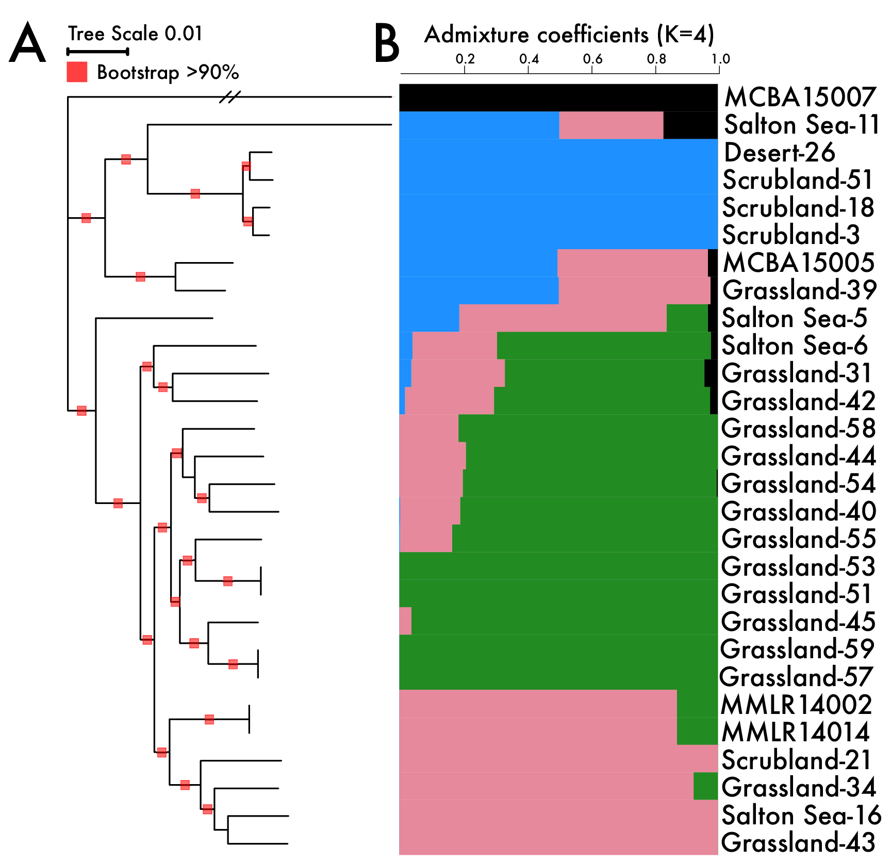

Relevant files for the analysis of population dynamics in the terrestrial bacterium, *Curtobacterium*

Manuscript: 
["Maintenance of Sympatric and Allopatric Populations in Free-Living Terrestrial Bacteria"] (https://mbio.asm.org/content/10/5/e02361-19)

AB Chase, P Arevalo, EL Brodie, MF Polz, U Karaoz, and JBH Martiny. 2019.

# Bacterial Species Definition
To do so, we defined a bacterial species using the ecotype framework or a cluster of closely-related strains with the same ecological niche. For a more in-depth framework, please read the exeptional perspective by [Rocha. MBE. 2019.](https://academic.oup.com/mbe/article/35/6/1338/4976545)

## *Curtobacterium*
Within *Curtobacterium*, we previously conducted a thorough investigation into the environmental resources driving niche partitioning along a [regional climate gradient](https://www.pnas.org/content/115/47/11994).

Relevant results from [Chase et al. EMI. 2018.](https://onlinelibrary.wiley.com/doi/full/10.1111/1462-2920.14405)

>Our results revealed that cultured isolates separated into fine‐scale genetic clusters that reflected distinct suites of phenotypic traits, denoting the existence of multiple ecotypes.
>
>Functional traits assayed to delineate ecotypes: growth, biofilm formation and depolymerization of xylan and cellulose. All assays were further assessed along a temperature gradient.
>
>Six abundant ecotypes were observed with differential abundances along the gradient, suggesting fine‐scale niche partitioning.

For this study, we analyzed the genetic diversity of 28 genomes within a single ecotype, Subclade IB/C

# Software and Databases Used
[NCBI Curtobacterium Genomes](https://www.ncbi.nlm.nih.gov/genome/16071)

## Core and Flexible Genome
Ortholog Prediction: [ROARY](https://sanger-pathogens.github.io/Roary/)

Phylogenetic Analysis: [RAxML](https://cme.h-its.org/exelixis/software.html)

Core Genome Alignment: [progressiveMAUVE](http://darlinglab.org/mauve/user-guide/progressivemauve.html)

## Recombination Analyses
[PopCOGenT](https://github.com/philarevalo/PopCOGenT)

[ClonalFrameML](https://github.com/xavierdidelot/ClonalFrameML)
